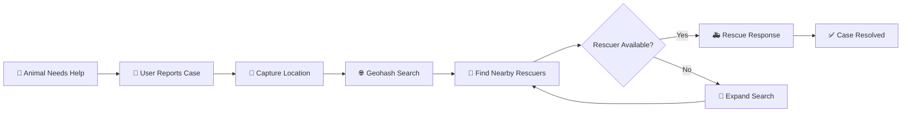

# 🐾 JeevSahay

<p align="center">
  <strong>Connect. Rescue. Save a Life.</strong><br/>
  A privacy-first animal rescue platform that helps people find nearby rescuers quickly.
</p>

<p align="center">
  <a href="https://jeev-sahay.vercel.app/">
    
  </a>
  
  
  
</p>

---

## 🎬 Demo

<p align="center">
  <a href="YOUR_VIDEO_LINK">
    
  </a>
</p>

<p align="center">
  
</p>

---

## 🌱 What is JeevSahay?

JeevSahay is a **pan-India animal rescue platform** designed to solve one simple problem:

> **When an animal needs help, how do you find the nearest available rescuer?**

The platform uses **location-based matching and geohashing** to surface nearby rescue cases and rescuers while keeping data collection minimal.

---

## ✨ Features

```text
📍 Nearby Rescuer Matching
🗺️ Interactive Map
🐾 Animal Rescue Reporting
⚡ Fast Geo-search
🔒 Privacy-first Data Handling
💾 Local-first Experience
📱 Responsive UI
🚀 Lightweight Vite Architecture
```

---

## 🔄 Rescue Flow



---

## 🏗️ Architecture

```text
                  ┌───────────────────┐
                  │     JeevSahay     │
                  └─────────┬─────────┘
                            │
          ┌─────────────────┼─────────────────┐
          ▼                 ▼                 ▼
      React UI          Map Layer        Data Layer
          │                 │                 │
          ▼                 ▼                 ▼
      Vite App           Leaflet          Firebase
                            │                 │
                            └────────┬────────┘
                                     ▼
                              Geohash Search
                                     │
                                     ▼
                           Nearby Rescue Matching
```

---

## 🧠 Core Matching Logic

```text
Report Case
    ↓
Get Coordinates
    ↓
Convert → Geohash
    ↓
Search Nearby Cells
    ↓
Find Rescuers / Cases
    ↓
Show on Map
    ↓
Connect Help
```

---

## 🛠️ Tech Stack

| Layer | Technology |
|---|---|
| Frontend | **React 19 + Vite** |
| Styling | **Tailwind CSS** |
| Backend | **Firebase** |
| Geo Search | **geofire-common / Geohashing** |
| Maps | **Leaflet + React Leaflet** |
| Routing | **React Router** |
| State | **Zustand** |
| Icons | **Lucide React** |
| Deployment | **Vercel** |

---

## 📁 Project Structure

```text
JeevSahay/
├── .github/
├── .agents/
├── docs/
├── public/
├── src/
│   ├── assets/
│   ├── components/
│   ├── data/
│   ├── hooks/
│   ├── pages/
│   ├── App.jsx
│   ├── firebase.js
│   ├── firebaseConfig.js
│   ├── index.css
│   └── main.jsx
├── package.json
├── vite.config.js
└── vercel.json
```

---

## 🚀 Run Locally

```bash
git clone https://github.com/AkshatRaj00/JeevSahay.git
cd JeevSahay
npm install
npm run dev
```

Configure your Firebase environment before running the application.

---

## 🔮 Roadmap

```text
Verification
     ↓
Case Tracking
     ↓
Notifications
     ↓
Multi-language Support
     ↓
Pan-India Rescue Network 🐾
```

---

## 🌐 Live

<p align="center">
  <a href="https://jeev-sahay.vercel.app/">
    
  </a>
</p>

---

<p align="center">

### 🐾 JeevSahay

<strong>Technology for those who cannot ask for help.</strong>

<br/><br/>

Built with ❤️ by <b>Akshat Raj</b>

</p>
